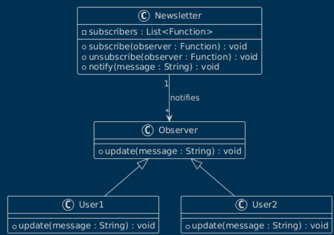
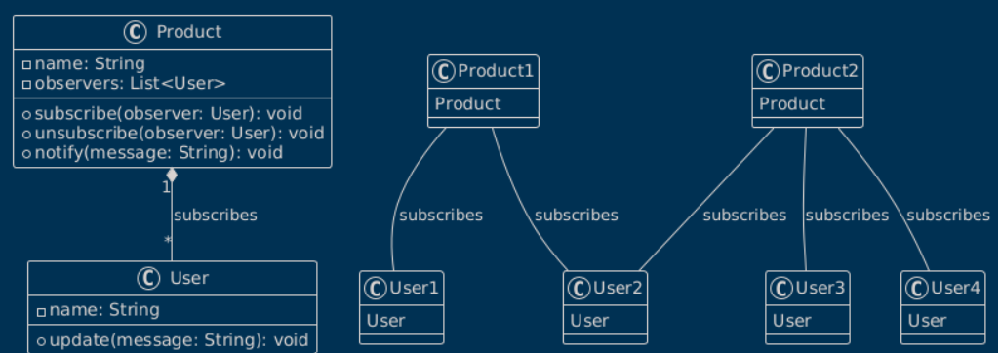

## Observer Design Pattern (notify system)

run a function with data of subscriber.

In react js we have redux. 

The Observer Pattern is a behavioral design pattern that allows an object (called the Subject) to maintain a list of its dependents (called Observers) and automatically notify them of any state changes, usually by calling a method in the observer. This pattern promotes a one-to-many relationship.

```js
// Observer class
class Newsletter {
    constructor() {
        this.subscribers = []; // List of observers
    }

    // Add an observer
    subscribe(observer) {
        this.subscribers.push(observer);
    }

    // Remove an observer
    unsubscribe(observer) {
        this.subscribers = this.subscribers.filter((sub) => sub !== observer);
    }

    // Notify all observers
    notify(message) {
        this.subscribers.forEach((subscriber) => subscriber(message));
    }
}

// Usage
const newsletter = new Newsletter();

// Subscribers (Observers)
const user1 = (message) => console.log(`User1 received: ${message}`);
const user2 = (message) => console.log(`User2 received: ${message}`);

// Subscribe users
newsletter.subscribe(user1);
newsletter.subscribe(user2);

// Notify subscribers
newsletter.notify("New edition of the newsletter is available!");

// Unsubscribe a user
newsletter.unsubscribe(user1);

// Notify again
newsletter.notify("Second edition is out!");

```


### Diagram




### Explanation of the Code in Simple Steps:

1. **Define the `Newsletter` class**:
   - This class manages a list of subscribers (observers) and allows adding, removing, and notifying them.

2. **Key Methods**:
   - **`subscribe(observer)`**: Adds an observer (e.g., `user1` or `user2`) to the subscriber list.
   - **`unsubscribe(observer)`**: Removes an observer from the subscriber list.
   - **`notify(message)`**: Sends a message to all subscribed observers by calling their functions.

3. **Usage**:
   - Create an instance of the `Newsletter` class: `const newsletter = new Newsletter();`.
   - Define observer functions (`user1`, `user2`) that handle messages.

4. **Subscribe Observers**:
   - Add observers to the `Newsletter` instance using the `subscribe` method.

5. **Notify Subscribers**:
   - Call `notify(message)` to send a message to all subscribed observers. Each observer receives the message and processes it (e.g., prints it to the console).

6. **Unsubscribe Observers**:
   - Remove an observer using `unsubscribe(observer)`. It will no longer receive notifications.

7. **Final Notifications**:
   - After unsubscribing `user1`, calling `notify` again sends the message only to the remaining observers (e.g., `user2`).

---

### Code Walkthrough with Example:
1. **Subscription**:
   - `user1` and `user2` subscribe to the newsletter.
   - Both will receive notifications.

2. **Notification 1**:
   - The message `"New edition of the newsletter is available!"` is sent to both `user1` and `user2`.

3. **Unsubscription**:
   - `user1` unsubscribes and will no longer receive messages.

4. **Notification 2**:
   - The message `"Second edition is out!"` is sent only to `user2`. 

This demonstrates the **Observer Pattern** in a simple, practical scenario!


### Using EventEmitter in Node.js

Node.js has a built-in EventEmitter class that simplifies implementing the Observer Pattern.


```js
const EventEmitter = require('events');

// Create an instance of EventEmitter
const chatRoom = new EventEmitter();

// Observer functions (Subscribers)
const user1 = (message) => console.log(`User1: ${message}`);
const user2 = (message) => console.log(`User2: ${message}`);

// Subscribe to the 'message' event
chatRoom.on('message', user1);
chatRoom.on('message', user2);

// Emit an event
chatRoom.emit('message', "Hello, everyone!");

// Unsubscribe user1
//message is a name of event 
chatRoom.off('message', user1);

// Emit another event
chatRoom.emit('message', "User1 won't see this.");

```


## Observer Pattern with a Custom Class

```js
class Stock {
    constructor(symbol) {
        this.symbol = symbol;
        this.price = 0;
        this.observers = [];
    }

    // Add observer
    addObserver(observer) {
        this.observers.push(observer);
    }

    // Remove observer
    removeObserver(observer) {
        this.observers = this.observers.filter((obs) => obs !== observer);
    }

    // Notify observers of price change
    notifyObservers() {
        this.observers.forEach((observer) => observer(this.symbol, this.price));
    }

    // Simulate price update
    updatePrice(newPrice) {
        this.price = newPrice;
        this.notifyObservers();
    }
}

// Usage
const stock = new Stock("AAPL");

// Observers
const display = (symbol, price) => console.log(`Price of ${symbol}: $${price}`);
const alert = (symbol, price) => {
    if (price > 150) console.log(`Alert! ${symbol} is above $150!`);
};

// Subscribe observers
stock.addObserver(display);
stock.addObserver(alert);

// Update stock prices
stock.updatePrice(145);
stock.updatePrice(155);

```

For two products

```js
// Custom Observer Pattern Implementation

// Subject (Publisher)
class Product {
    constructor(name) {
        this.name = name;
        this.observers = []; // List of observers (subscribers)
    }

    // Add an observer
    subscribe(observer) {
        this.observers.push(observer);
    }

    // Remove an observer
    unsubscribe(observer) {
        this.observers = this.observers.filter((obs) => obs !== observer);
    }

    // Notify all observers
    notify(message) {
        console.log(`\n[Notification from ${this.name}]: ${message}`);
        this.observers.forEach((observer) => observer.update(message));
    }
}

// Observer (Subscriber)
class User {
    constructor(name) {
        this.name = name;
    }

    // Method to receive updates
    update(message) {
        console.log(`${this.name} received: ${message}`);
    }
}

// Create instances of Product
const product1 = new Product("Laptop");
const product2 = new Product("Smartphone");

// Create instances of Users
const user1 = new User("Alice");
const user2 = new User("Bob");
const user3 = new User("Charlie");

// Subscribing to product notifications
product1.subscribe(user1);
product1.subscribe(user2);
product2.subscribe(user2);
product2.subscribe(user3);

// Notify subscribers about product updates
product1.notify("New Laptop model is now available!");
product2.notify("Smartphone sale starts tomorrow!");

// Unsubscribe a user and send another notification
product1.unsubscribe(user2);
product1.notify("Laptop price has dropped!");

```





# create a notification system


```js
const WebSocket = require('ws');

class Stock {
    constructor(symbol) {
        this.symbol = symbol;
        this.price = 0;
        this.observers = []; // This will hold WebSocket connections
    }

    // Add observer (WebSocket connection)
    addObserver(ws) {
        this.observers.push(ws);
    }

    // Remove observer (close WebSocket)
    removeObserver(ws) {
        this.observers = this.observers.filter((observer) => observer !== ws);
    }

    // Notify observers of price change
    notifyObservers() {
        const message = JSON.stringify({ symbol: this.symbol, price: this.price });
        this.observers.forEach((ws) => {
            if (ws.readyState === WebSocket.OPEN) {
                ws.send(message);
            }
        });
    }

    // Simulate price update
    updatePrice(newPrice) {
        this.price = newPrice;
        this.notifyObservers();
    }
}

const stock = new Stock("AAPL");

// WebSocket Server
const wss = new WebSocket.Server({ port: 8080 });

wss.on('connection', (ws) => {
    console.log("New client connected!");

    // Add new connection to observers
    stock.addObserver(ws);

    // Handle client disconnect
    ws.on('close', () => {
        console.log("Client disconnected!");
        stock.removeObserver(ws);
    });
});

// Simulate stock price updates every 5 seconds
setInterval(() => {
    const newPrice = (Math.random() * 200).toFixed(2); // Random price between 0 and 200
    console.log(`Updating price of ${stock.symbol} to $${newPrice}`);
    stock.updatePrice(parseFloat(newPrice));
}, 5000);

console.log("WebSocket server is running on ws://localhost:8080");

```


```html
<!DOCTYPE html>
<html lang="en">
<head>
    <meta charset="UTF-8">
    <meta name="viewport" content="width=device-width, initial-scale=1.0">
    <title>Stock Notification</title>
    <style>
        #notifications {
            font-family: Arial, sans-serif;
            margin: 20px;
        }
    </style>
</head>
<body>
    <h1>Stock Notification System</h1>
    <div id="notifications"></div>

    <script>
        const ws = new WebSocket("ws://localhost:8080");

        ws.onopen = () => {
            console.log("Connected to the WebSocket server.");
        };

        ws.onmessage = (event) => {
            const { symbol, price } = JSON.parse(event.data);
            const notification = document.createElement("div");
            notification.textContent = `Price of ${symbol}: $${price}`;

            // Alert if price exceeds $150
            if (price > 150) {
                notification.style.color = "red";
                alert(`Alert! ${symbol} is above $150!`);
            } else {
                notification.style.color = "green";
            }

            document.getElementById("notifications").appendChild(notification);
        };

        ws.onclose = () => {
            console.log("Disconnected from the WebSocket server.");
        };

        ws.onerror = (error) => {
            console.error("WebSocket error:", error);
        };
    </script>
</body>
</html>

```

